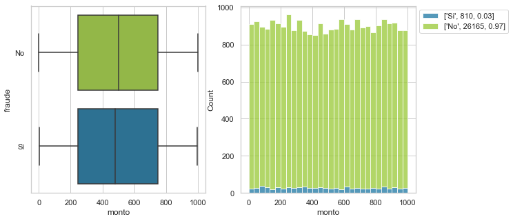
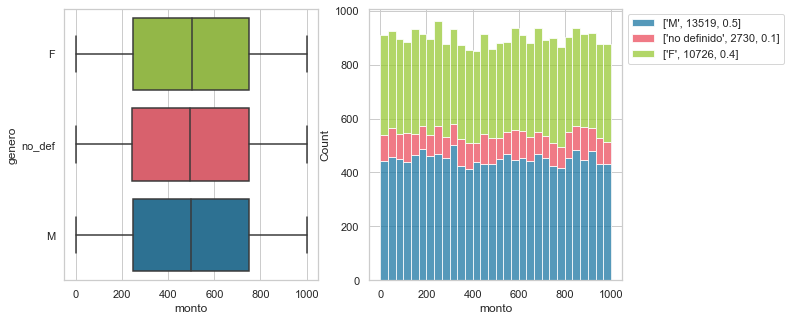
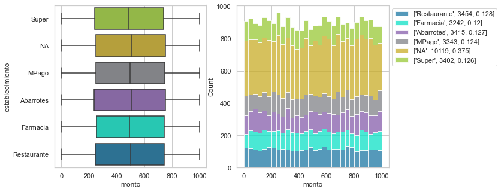
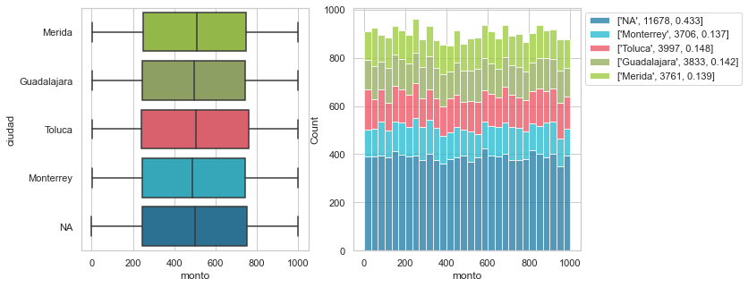
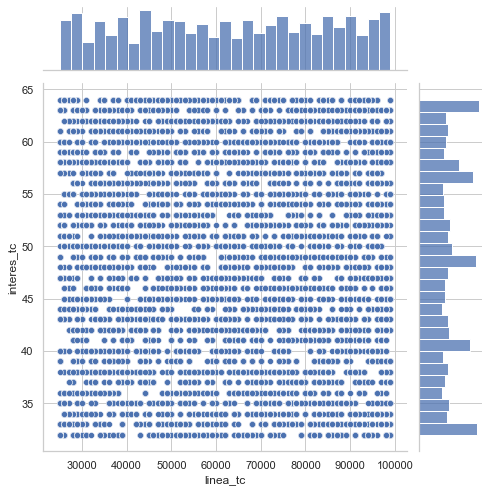
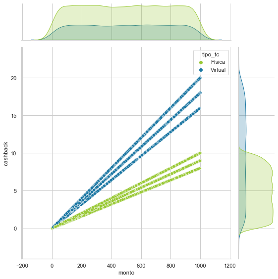
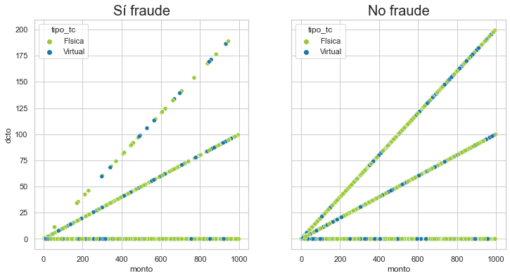
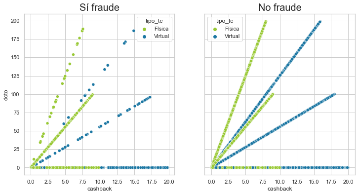

# Detección de fraude 

#### Por Elena Villalobos 
_____


El presente proyecto tiene como objetivo explorar y hacer el modelado de una base de datos que contiene transacciones fraudulentas. 

### Información general de la base

Se cuenta con 26,975 observaciones y 16 variables:

1. ID_USER

#### (Numéricas)

2. monto 
3. linea_tc 
4. interes_tc 
5. dcto
6. cashback

#### (Categóricas)

7. genero
8. dispositivo
9. establecimiento
10. ciudad
11. tipo_tc
12. status_txn
13. is_prime
14. fraude

#### (Temporales)

15. fecha
16. hora 

## Pregunta analítica

¿La transacción es fraudulenta o no?

## Análisis exploratorio 

A continuación se presentarán los gráficos y hallazgos más importantes (el código lo puedes encontrar en `notebooks/geda.ipynb`.

#### Fraude y monto de transacción

En la siguiente figura se tiene un diagrama de caja y un histogramas con la información del monto de transacción, con respecto a si la observación fue fraude o no (verde y azul). En esta figura puede apreciar que no existe diferencia en la distribución de los montos de acuerdo a si la transacción fue fraude o no. Además, se puede apreciar una distribución uniforme con respecto a los montos, que van de 0 a 1000.

En cuanto a la variable de fraude, 810 (3\%)  de las transacciones fueron fraude, mientras que 26,165 (97\%) fueron transacciones legítimas (tal como se muestra en la leyenda en el extremo derecho del gráfico). 



#### Género y monto de transacción

En cuanto al género, no hay diferencias si se toma de referencia la variable de monto. De éstas categorías el 50\% pertenecen a masculino, 40\% a femenino y el 10\% no se tiene definido. 



#### Establecimiento, ciudad y monto de transacción

Tanto la variable de establecimiento como la de ciudad tienen un comportamiento similar. Esto es debido a que se observa claramente una distribución y dispersión muy similar entre sus respectivas categorías. Además, en ambas variables se aprecia una mayor presencia valores faltantes (37\% establecimiento, 43\% ciudad), mientras de las categorías tienen cantidades muy balanceadas. 
). 





####  Variables numéricas

Se obtuvo la correlación entre las variables numéricas de la base y se observó presencia de correlación alta positiva entre monto y cashback (0.81). Mientras para las variables dcto y monto sólo una correlación de (0.29), y entre cashback y dcto (0.15). Todas las demás combinaciones, tuvieron una correlación muy cercana a cero. 

####  Interés y línea para la tarjeta de crédito. 

En la siguiente figura se puede apreciar un scatterplot entre las variables linea_tc e interes_tc, en la que no hay relación notable entre ambas variables, además de que ambas parecen seguir una distribución uniforme. 



#### Relación entre cashback, monto y tipo_tc.

Para el scatterplot entre las variables de monto y cashback, además de coloreadas por si la transacción fue física o virtual (tipo_tc), se observan 6 líneas rectas donde a mayor monto mayor cashback que se podrían considerar como agrupaciones. Adicionalmente, la transacción donde la tarjeta fue virtual, tiene montos más altos que los de tarjeta física. Esto se puede deber a reglas específicas que tiene por default el programa financiero. 



#### Relación entre cashback, dcto, monto y fraude

En los siguientes dos gráficos se presenta un scatterplot con las variables monto vs dcto, y cashback y dcto, ambos están sub-seccionados entre si la transacción fue un fraude o no. Este fue de las únicas figuras donde se encontró un poco de diferencia distinguible visualmente, pues a pesar de que fraude tiene mucho menos observaciones el comportamiento para algunas agrupaciones (líneas), es diferente para algunas líneas. 


   

 
 
 ## Feature selección 
 
 Además, de realizar una ingeniería de características, se realizó un procedimiento para la selección de variables `notebooks/feature_selection.ipynb`. Se utilizó un Random Forest dentro de GridSearch para determinar sólo la importancia de cada variable. Esto se realizó debido a que a pensar de que los gráficos nos ayudaron a entender los datos, se necesita un procedimiento que nos ayude a seleccionar las variables a considerar en el modelo. 
 
 De acuerdo a este proceso, se eliminó la variable de si la tarjeta es prime. De un principio se consideró que la variable dispositivo, tenía categorías muy similares y de gran cantidad, por lo que, no se consideró para el análisis. Tampoco la variable de status_txn se colocó en el modelo, debido a que se asume que este es un proceso posterior a la transacción, por lo que no nos puede ayudar a clasificar si la transacción fue fraude o no. 
 
 Por último, apesar de que las variables temporales, no presentaron patrones claros, se consideraron en el análisis y se transformaron como variables cíclicas para el modelamiento. 
 
 ## Datos no balanceados
 
Tanto para la selección de variables como para el modelamiento  se realizó un submuestreo de las observaciones que no tenían fraude. Este procedimiento es algo común para realizar el análisis de operaciones fraudulentas, pues debido a que se tiene cantidad de etiquetas muy diferente, los resultados en el modelamiento pueden estar sesgados (ver `referencias/*.pdf`).
 
 ## Modelamiento y métricas
 
Se eligió un modelo de regresión logística como algoritmo para hacer las predicciones y su desempeño fue el siguiente: 

 
- score modelo: 0.459
- precision score: 0.462.
- recall score: 0.5.
- accuracy score: 0.459.

 
Como se observa las métricas son muy deficientes, por lo que hacer una predicción sobre este modelo no convendría. 

Se asume se obtuvieron estos resultados debido a el trabajo de submuestreo, pues se cuentan con muy pocos datos. También, las variables de linea_tc, interes_tc, las transformaciones cíclicas de hora y día, a pesar de haber salido como importantes en la selección de variables, consideraría que necesitan análisis adicionales pues sus distribuciones son muy uniformes. 

## Para correr el modelamiento

Clona el repo

`git clone https://github.com/ElenaVillano/challenge_rpmx.git`

Actualiza el pip install

 `pip install --upgrade pip`
 

- Puedes crear tu ambiente ([aquí una guía de instalación para pyenv](https://github.com/pyenv/pyenv)), y activar tu pyenv:

```
pyenv virtualenv 3.7.4 dpa_equipo_10
pyenv activate dpa_equipo_10
pip install -r requirements.txt
```

Instalas los requirements:

 `pip install -r requirements.txt`.
 
 
 Y corres la siguiente línea para ver las variables seleccionadas y los resultados del modelo:
 
 `python deteccion_fraude.py`
 
 
 
 