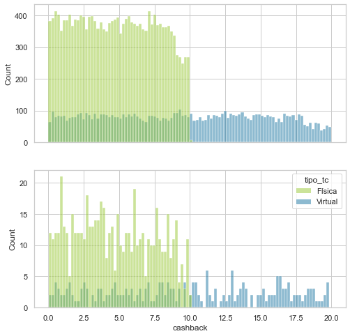

# Detección de fraude 

#### Por Elena Villalobos 
_____

El presente proyecto tiene como objetivo explorar y hacer el modelado de una base de dato que contiene transacciones fraudulentas. 

### Información general de la base

Se cuenta con 26,975 observaciones y 16 variables:

1. ID_USER

#### (Numéricas)

2. monto 
3. linea_tc 
4. interes_tc 
5. dcto
6. cashback

#### (Categóricas)

7. genero
8. dispositivo
9. establecimiento
10. ciudad
11. tipo_tc
12. status_txn
13. is_prime
14. fraude

#### (Temporales)

15. fecha
16. hora 

## Pregunta analítica

¿La transacción es fraudulenta o no?

## Análisis exploratorio 

A continuación se presentarán los gráficos y hallazgos más importantes (el código lo puedes encontrar en `notebooks/geda.ipynb`.

#### Fraude y monto de transacción

En la siguiente figura se tiene un diagrama de caja y un histogramas con la información del monto de transacción, con respecto a si la observación fue fraude o no (verde y azul). En esta figura puede apreciar que no existe diferencia en la distribución de los montos de acuerdo a si la transacción fue fraude o no. Además, se puede apreciar una distribución uniforme con respecto a los montos, que van de 0 a 1000.

En cuanto a la variable de fraude, 810 (3\%)  de las transacciones fueron fraude, mientras que 26,165 (97\%) fueron transacciones legítimas (tal como se muestra en la leyenda en el extremo derecho del gráfico). 

#### Género y monto de transacción

En cuanto al género, no hay diferencias si se toma de referencia la variable de monto. De éstas categorías el 50\% pertenecen a masculino, 40\% a femenino y el 10\% no se tiene definido. 

#### Establecimiento, ciudad y monto de transacción

Tanto la variable de establecimiento como la de ciudad tienen un comportamiento similar. Esto es debido a que se observa claramente una distribución y dispersión muy similar entre sus respectivas categorías. Además, en ambas variables se aprecia una mayor presencia valores faltantes (37\% establecimiento, 43\% ciudad), mientras de las categorías tienen cantidades muy balanceadas. 
). 

####  Variables numéricas

Se obtuvo la correlación entre las variables numéricas de la base y se observó presencia de correlación alta positiva entre monto y cashback (0.81). Mientras para las variables dcto y monto sólo una correlación de (0.29), y entre cashback y dcto (0.15). Todas las demás combinaciones, tuvieron una correlación muy cercana a cero. 

####  Interés y linea para la tarjeta de crédito. 

fdsalh

   

    

 
