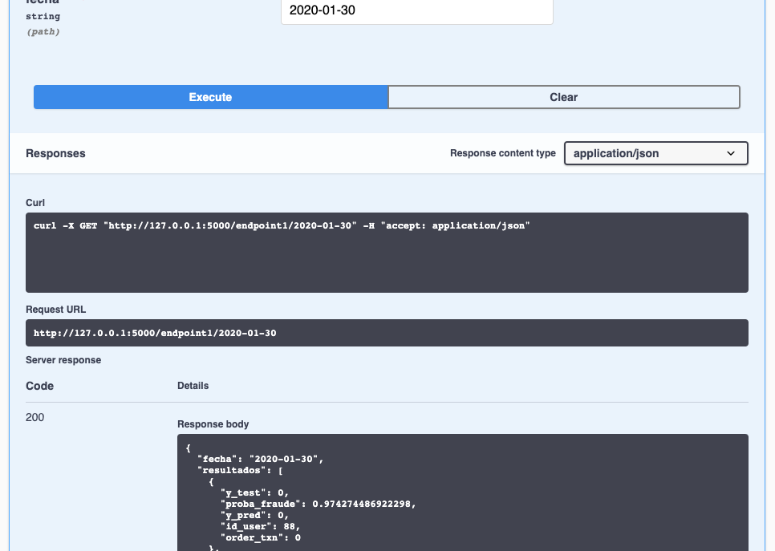

# Detección de fraude 

#### Por Elena Villalobos 
_____


El presente proyecto tiene como objetivo explorar y hacer el modelado de una base de datos que contiene transacciones fraudulentas. 

### Información general de la base

Se cuenta con 26,975 transacciones y 16 variables:

1. ID_USER (4,000 usuarios)

#### (Numéricas)

2. monto 
3. linea_tc 
4. interes_tc 
5. dcto
6. cashback

#### (Categóricas)

7. genero
8. dispositivo
9. establecimiento
10. ciudad
11. tipo_tc
12. status_txn
13. is_prime
14. fraude

#### (Temporales)

15. fecha
16. hora 

## Pregunta analítica

¿La transacción es fraudulenta o no?

## Análisis exploratorio 

A continuación se presentarán los hallazgos más importantes y algunos gráficos (el código y todos los gráficos realizados los puedes ver a detalle en `notebooks/geda.ipynb`).

#### Fraude y monto de transacción

En la siguiente figura se tiene un diagrama de caja y un histogramas con la información del monto de transacción, con respecto a si la observación fue fraude o no (verde y azul). En esta figura se puede apreciar que no existe diferencia en la distribución de los montos de acuerdo a si la transacción fue fraude o no. Además, se puede apreciar una distribución uniforme con respecto a los montos, que van de 0 a 1000.

En cuanto a la variable de fraude, 810 (3\%)  de las transacciones fueron fraude, mientras que 26,165 (97\%) fueron transacciones legítimas (tal como se muestra en el extremo derecho del gráfico). 


#### Género y monto de transacción

En cuanto al género, no hay diferencias si se toma de referencia la variable de monto. De éstas categorías el 50\% pertenecen a masculino, 40\% a femenino y el 10\% no definido. 


#### Establecimiento, ciudad y monto de transacción

Tanto la variable de establecimiento como la de ciudad tienen un comportamiento similar. En ambas se observa claramente una distribución y dispersión muy similar entre sus respectivas categorías. Además, en las dos variables se aprecia mayor presencia valores faltantes (37\% en establecimiento y 43\% ciudad), mientras que sus categorías tienen cantidades muy balanceadas entre ellas. 


####  Variables numéricas

Se obtuvo la correlación entre las variables numéricas de la base y se obtuvo correlación alta positiva entre monto y cashback (0.81). Mientras para las variables dcto y monto sólo una correlación de (0.29), y entre cashback y dcto de (0.15). Todas las demás combinaciones, tuvieron correlaciones muy cercanas a cero. 

####  Interés y línea para la tarjeta de crédito. 

En la siguiente figura se puede apreciar un scatterplot entre las variables linea_tc e interes_tc, en la que no hay relación notable entre ambas variables, además de que ambas parecen seguir una distribución uniforme marginalmente. 


#### Relación entre cashback, monto y tipo_tc.

Para el scatterplot entre las variables de monto y cashback, además de coloreadas por el tipo_tc, se observan 6 líneas rectas donde a mayor monto, mayor cashback, las cuales se podrían considerar como agrupaciones. Adicionalmente, la transacción donde la tarjeta fue virtual, tiene montos más altos que los de tarjeta física. Esto se puede deber a reglas específicas que tiene por default el programa financiero. 


#### Relación entre cashback, dcto, monto y fraude

En los siguientes dos gráficos se presenta un scatterplot con las variables monto vs dcto, y cashback y dcto, ambos están sub-seccionados entre si la transacción fue un fraude o no, además de distinguir por el tipo_tc. A pesar de que fraude tiene mucho menos observaciones, el comportamiento para algunas agrupaciones (líneas) es diferente. 


   


#### Hora y fecha

En el siguiente mapa de calor, no se nota algún patrón claro sobre la fecha y hora.


 
 
 ## Feature selección 
 
Además, de realizar una ingeniería de características, se realizó un procedimiento para la selección de variables `notebooks/feature_selection.ipynb`. Se utilizó un Random Forest dentro de GridSearch para determinar sólo la importancia de cada variable. Esto se realizó debido a que a pensar de que los gráficos nos ayudaron a entender los datos, se necesita un procedimiento adicional que nos ayude a seleccionar las variables a considerar en el modelo. 
 
De acuerdo a este proceso, se eliminó la variable de si la tarjeta es prime. Adicionalmente, se consideró que la variable dispositivo tenía muchas categorías muy similares, por lo que no se consideró para el análisis. Tampoco la variable de status_txn se colocó en el modelo, debido a que se asume que este es un proceso posterior a la transacción, por lo que no nos puede ayudar a clasificar si la transacción fue fraude o no. 
 
Por último, apesar de que las variables temporales, no presentaron patrones claros, se consideraron en el análisis y se transformaron como variables cíclicas para el modelamiento. 
 
 ## Datos no balanceados
 
Tanto para la selección de variables como para el modelamiento  se realizó un submuestreo de las transacciones que no tenían fraude. Este procedimiento es una recomendación para realizar análisis de operaciones fraudulentas, pues debido a que se tiene cantidad de etiquetas muy diferente, los resultados en el modelamiento pueden estar sesgados (ver `referencias/*.pdf`). 
 
 ## Modelamiento y métricas
 
Se eligió un modelo de regresión logística como algoritmo para hacer las predicciones y su desempeño en general fue muy deficiente en cuanto a las métricas de precision, recall y accuracy. 

Se asume se obtuvieron estos resultados debido al trabajo de submuestreo, pues se cuentan con muy pocos datos. Además, las variables de linea_tc, interes_tc, las transformaciones cíclicas de hora y día, a pesar de haber salido como importantes en la selección de variables, consideraría que necesitan análisis adicionales pues sus distribuciones son muy uniformes. 

# Model deployment

Para este proceso se asume que se obtuvo un buen modelo que predice bien los datos de fraude. El modelo elegido se encuentra en la carpeta de `model/selected_model.pkl`. Dicho modelo  se calibró con toda la base de datos, por lo que sus métricas son mucho mejores, pero están sesgadas.  Adicionalmente, se hizo una base de datos adicional para tomarla como test de que funciona bien el producto de datos. 


### Para correr este proyecto sigue las siguientes instrucciones. 

- Clona el repo

`git clone https://github.com/ElenaVillano/challenge_rpmx.git`

- Actualiza el pip install

 `pip install --upgrade pip`

- Crea ([aquí una guía de instalación para pyenv](https://github.com/pyenv/pyenv)), y activa tu pyenv:

```
pyenv virtualenv 3.7.4 det_fraudes
pyenv activate det_fraudes
```

- Instala los requirements:

 `pip install -r requirements.txt`.

 
### 1. Base de datos RDS.
 
- Este producto tiene una base de datos de acceso público, por lo que sólo necesitas crear un archivo `conf/local/credentials.yaml` que tenga las credenciales, esto lo puedes hacer con las siguientes líneas de código:

```
mkdir conf/local
touch conf/local/credentials.yaml
nano conf/local/credentials.yaml
```
 
dentro de este archivo, coloca la información de la base de la siguiente manera:
 
```
---
db:
  user: postgres
  password: prediccionfraude
  dbname: postgres
  host: fraudedbtres.cmz4apd9rrhn.us-east-1.rds.amazonaws.com
  port: 5432

```
 
*Ojo: generalmente estas llaves y/o claves son privadas, pero para observar el funcionamiento de manera más fácil se colocarán aquí para que puedas correr el pipeline completo en tu computadora.*

- Para acceder a la RDS debes asegurarte de tener instalado `psql` en tu computadora, en caso de no tenerlo puedes instalarlo con las siguientes líneas de código:


```
sudo apt-get update
sudo apt-get install postgresql-client
```

- Para acceder de manera más rápida a la base desde tu terminal puedes colocar en un archivo `.pg_service.conf` la información de la base de la siguiente manera: 

```
cd
nano .pg_service.conf
```

dentro de este archivo, colocar la siguiente estructura,

```
[fraude]
user=postgres
password=prediccionfraude
host=fraudedbtres.cmz4apd9rrhn.us-east-1.rds.amazonaws.com
port=5432
dbname=postgres

```

y para acceder sólo colocas en la terminal:

```
psql service=fraude
```

### 2. Para orquestar las tareas del presente pipeline, se utilizó Luigi. 

Para correrlo en tu computadora, asegúrate de:

- Tener tu pyen activado: `pyenv activate det_fraudes`
- Asegurarte que tienes los requerimientos `pip install -r requirements.txt`
- Y colocarte en la raíz del repo.

Para prender luigi esa misma terminal corre las siguientes líneas:

```
export PYTHONPATH=$PWD
luigid --port 8082
```

En otra terminal, igual activa tu pyenv y colócate en la raíz del repo, y corre la siguiente línea:

```
PYTHONPATH="." luigi --module src.pipeline.task_5_api  almacenamientoapi --fecha '2021-01-30'
```

y para ver el dag de luigi, coloca en tu buscador: `http://localhost:8082`.

Debes poder ver algo así:


Para este caso, la única fecha que tenemos *nuevos* datos es del 2020-01-30, este parámetros se cambiaría dependiendo de la fecha en la que se hace la ingesta de nueva información, sin embargo, se pueden agregar otros parámetros que identifiquen operaciones de fraude en mayor frecuencia. 


### 3. Para la producción del modelo se utilizó Flask.

Para ver las predicciones del modelo en tu local abre una terminal:

- Colócate en el siguiente path con: `cd challenge_rpmx/src/utils`.
- Allí avísale a flask que lo correrás con: `export FLASK_APP=flask_db.py`.
- Luego corre flask: `flask run`.

Y en un buscador colocar: `http://127.0.0.1:9992/`.

Dentro del flask, coloca la fecha de 2020-01-30, ejecútala, y podrás ver las predicciones que se tienen para esa *nueva* base de datos. 

Debes poder ver algo así: 




### 4. Para el monitoreo de datos se utilizó Dash. 

Para este paso, abre otra terminal:

- Colócate en el siguiente path con: `cd challenge_rpmx/src/utils`.
- Corre la siguiente línea: `python dashboard.py`.

Y en un buscador colocar `http://127.0.0.1:9993/`.

Debes poder ver algo así:


 
 #
 
 _____
 
 